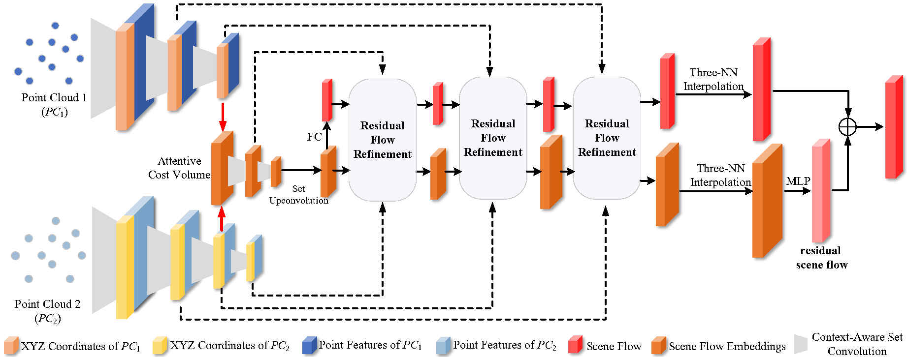
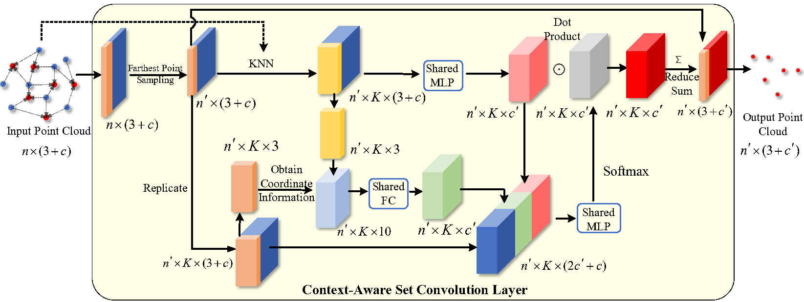
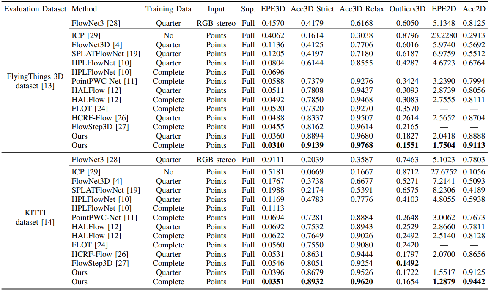

# **Residual 3D Scene Flow Learning with Context-Aware Feature Extraction** (IEEE Transactions on Instrumentation and Measurement)

This is the official implementations of our TIM 2022 [paper](https://arxiv.org/abs/2109.04685), "Residual 3D Scene Flow Learning with Context-Aware Feature Extraction" created by Guangming Wang, Yunzhe Hu, Xinrui Wu, and Hesheng Wang.  





## Citation

If you find our work useful in your research, please cite:

```
@article{wang2022residual,
  title={Residual 3-D Scene Flow Learning With Context-Aware Feature Extraction},
  author={Wang, Guangming and Hu, Yunzhe and Wu, Xinrui and Wang, Hesheng},
  journal={IEEE Transactions on Instrumentation and Measurement},
  volume={71},
  pages={1--9},
  year={2022},
  publisher={IEEE}
}
```

## Prerequisites

+ Python 3.6.9
+ PyTorch 1.5.0
+ CUDA 10.2
+ numba
+ tqdm

## Data preprocess

For fair comparison with previous methods, we adopt the preprocessing steps in [HPLFlowNet](https://web.cs.ucdavis.edu/~yjlee/projects/cvpr2019-HPLFlowNet.pdf). Please refer to [repo](https://github.com/laoreja/HPLFlowNet). We also copy the preprocessing instructions here for your reference.

* FlyingThings3D:
Download and unzip the "Disparity", "Disparity Occlusions", "Disparity change", "Optical flow", "Flow Occlusions" for DispNet/FlowNet2.0 dataset subsets from the [FlyingThings3D website](https://lmb.informatik.uni-freiburg.de/resources/datasets/SceneFlowDatasets.en.html) (we used the paths from [this file](https://lmb.informatik.uni-freiburg.de/data/FlyingThings3D_subset/FlyingThings3D_subset_all_download_paths.txt), now they added torrent downloads)
. They will be upzipped into the same directory, `RAW_DATA_PATH`. Then run the following script for 3D reconstruction:

```bash
python3 data_preprocess/process_flyingthings3d_subset.py --raw_data_path RAW_DATA_PATH --save_path SAVE_PATH/FlyingThings3D_subset_processed_35m --only_save_near_pts
```

* KITTI Scene Flow 2015
Download and unzip [KITTI Scene Flow Evaluation 2015](http://www.cvlibs.net/download.php?file=data_scene_flow.zip) to directory `RAW_DATA_PATH`.
Run the following script for 3D reconstruction:

```bash
python3 data_preprocess/process_kitti.py RAW_DATA_PATH SAVE_PATH/KITTI_processed_occ_final
```

## Usage

**Install pointnet2 library**

Compile the furthest point sampling, grouping and gathering operation for PyTorch. We use operations from this [repo](https://github.com/sshaoshuai/Pointnet2.PyTorch).

```
cd pointnet2
python setup.py install
cd ../
```

**Train**

Set `data_root` in `config_train.yaml`  to `SAVE_PATH` in the data preprocess section. Then run
```bash
python train.py config_train.yaml
```
After training the model with a quarter dataset, you can finetune the model with the full dataset and achieve a better results by running the following command. Remember to set `pretrain` in `config_train_finetune.yaml` as the path to the pretrained weights. 
```bash
python train.py config_train_finetune.yaml
```

**Evaluate**

We provide pretrained weights in ```pretrain_weights```.

Set `data_root` and in `config_evaluate.yaml` to `SAVE_PATH` in the data preprocess section, and specify `dataset` in the script . Then run
```bash
python evaluate.py config_evaluate.yaml
```

## Quantitative results



## Acknowledgements

We thank the following open-source projects for the help of the implementations.

+ [PointNet++](https://github.com/charlesq34/pointnet2) 

+ [HALFlow](https://github.com/IRMVLab/HALFlow)

+ [PointPWC-Net](https://github.com/DylanWusee/PointPWC)
